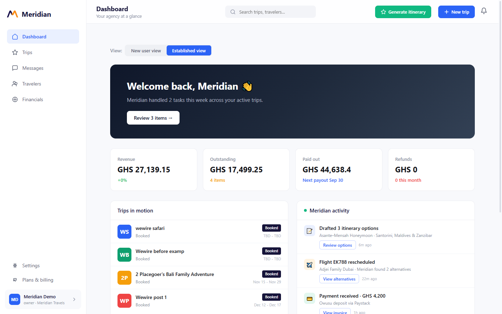
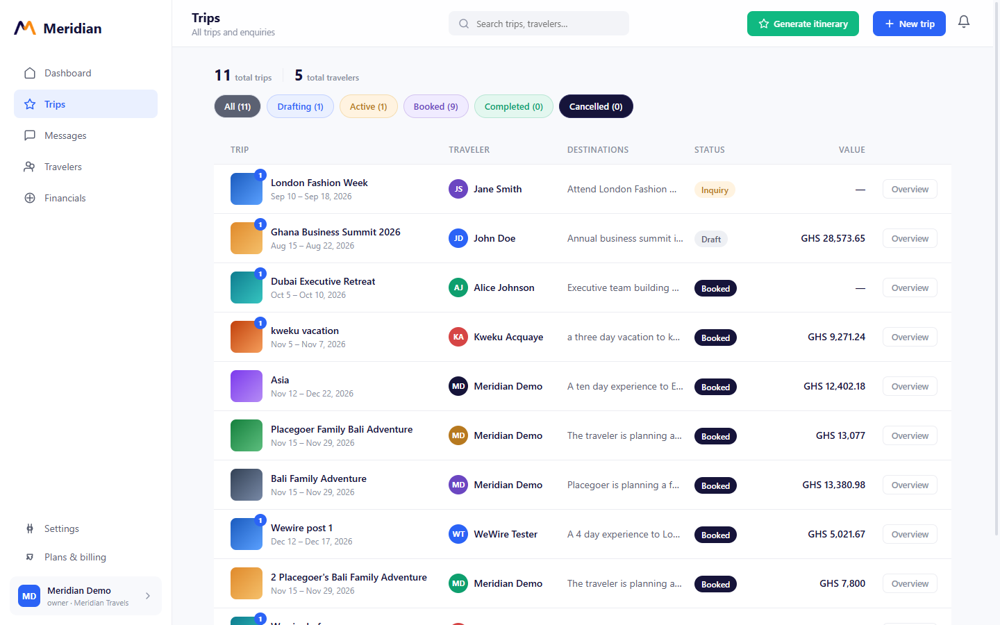
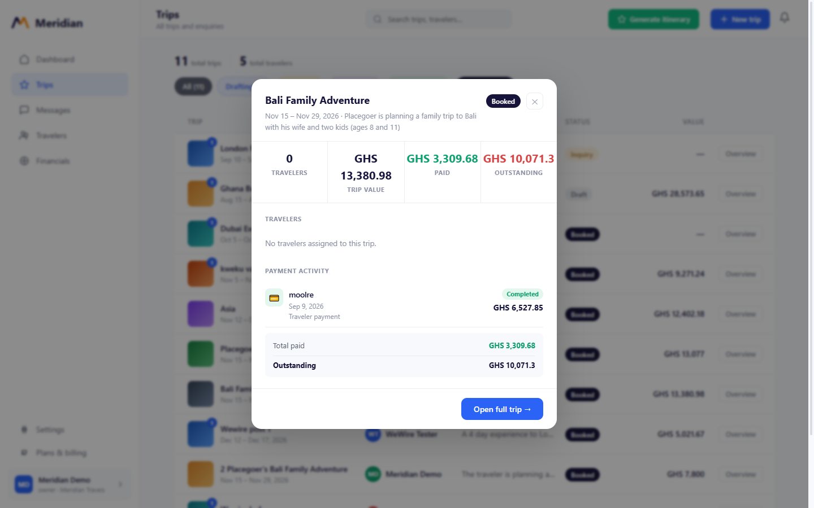
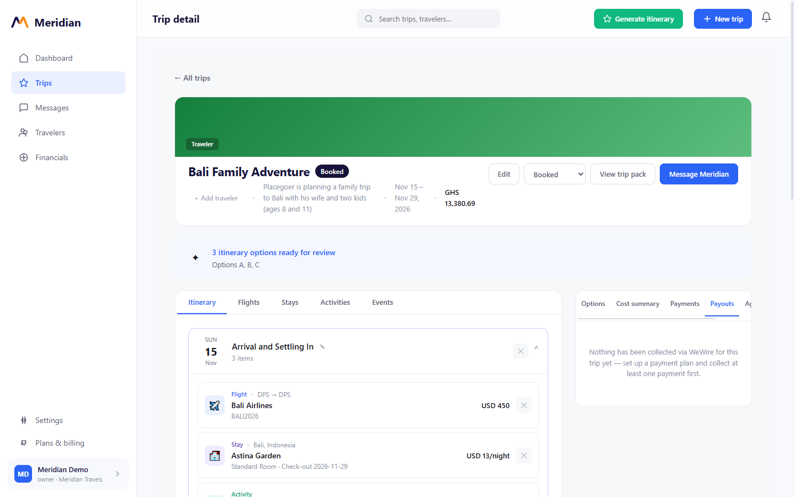
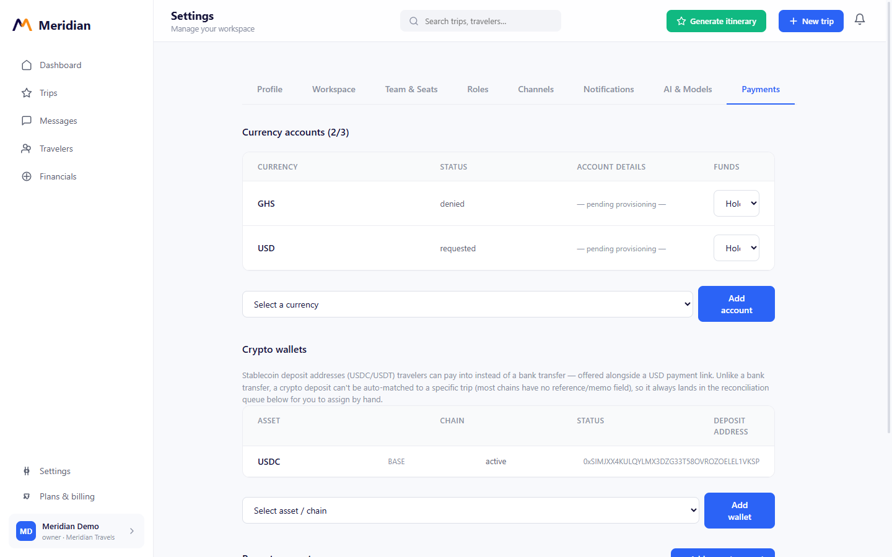
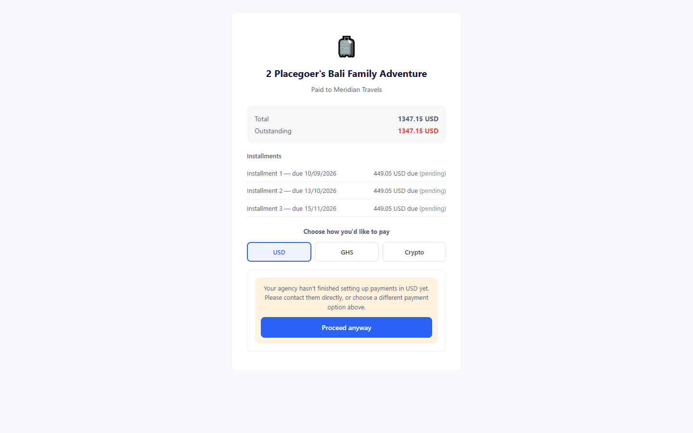
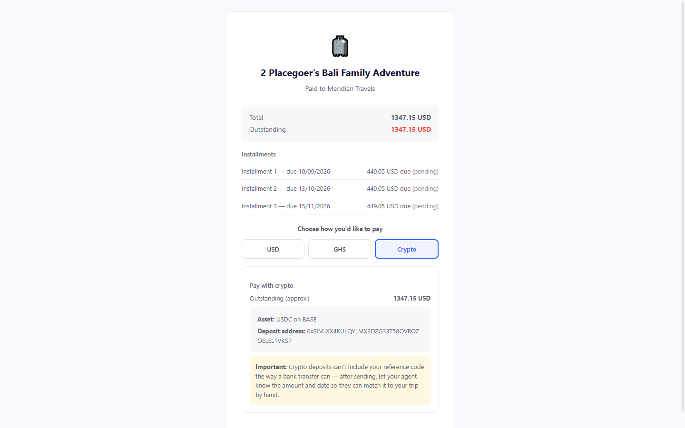

# Meridian Frontend

The dashboard for **Meridian**, an AI-assisted platform for travel agencies: build trip
itineraries, send them to travelers for approval, collect payment, and pay out flights,
hotels, and activity providers — all from one place.

React 19 + TypeScript + Vite. Pairs with [Meridian-Backend](../Meridian-Backend) (Laravel 12 API).

## Screenshots

**Dashboard** — revenue, outstanding balance, and trips-in-motion at a glance.



**Trips** — every trip, filterable by status, with its real computed value (not a stale
creation-time estimate).



**Trip overview** — a quick popup with travelers, payment activity, and a consistent
trip value / paid / outstanding summary.



**Trip detail** — itinerary, flights, stays, activities, and the payments/payouts panel for
a single trip.



**Settings → Payments** — WeWire virtual accounts (bank/mobile-money) and stablecoin crypto
wallets, managed per company.



**Public pay page** — a traveler picks how to pay (USD, GHS, or crypto) via an 8-character
reference code, with no Meridian account required. An option that isn't set up yet still
offers to proceed through the same live-check/simulated-fallback flow rather than dead-ending.

<p>
  
  
</p>

## What it does

- **Trip & itinerary management** — create trips, generate itinerary options with AI, review
  flights/stays/activities day-by-day, and track status through to booked/completed.
- **Payments** — the `/pay/{reference}` public page lets a traveler pay via bank transfer,
  mobile money, or a stablecoin crypto wallet, whichever the agency has set up; `Settings →
  Payments` is where an agency provisions those accounts/wallets.
- **Payouts** — pay the agency itself or a specific service provider (airline, hotel, activity)
  out of what's been collected on a trip, from the trip detail page.
- **Messaging** — Gmail threads tied to a trip/customer surface inline.
- **A shared "Response from wewire server" popup** (`WeWireFallbackModal`) — any WeWire-backed
  action that fails live shows what WeWire actually said and offers to proceed with a
  simulated result instead, everywhere the app calls a WeWire endpoint.

## Tech stack

| | |
|---|---|
| Framework | React 19, TypeScript, Vite |
| Routing | React Router |
| HTTP | Axios (`src/services/api-service.ts`, one method per backend endpoint) |
| Auth | Firebase (Google sign-in) + Sanctum bearer tokens issued by the backend |
| Styling | Plain CSS per component/page (`src/styles/`) |

## Getting started

```bash
npm install
cp .env.example .env   # if present, otherwise create one — see below
npm run dev
```

`.env` needs at least:

```
VITE_API_BASE_URL=http://127.0.0.1:8000/api
VITE_FIREBASE_API_KEY=...
VITE_FIREBASE_AUTH_DOMAIN=...
VITE_FIREBASE_PROJECT_ID=...
```

Point `VITE_API_BASE_URL` at wherever the backend is actually running — `php artisan serve`
(port 8000) or a local Apache/XAMPP vhost both work, it just needs to be a URL the backend's
`config/cors.php` allow-lists (`localhost:5173` / `127.0.0.1:5173` are allowed by default for
Vite's dev server).

## Scripts

```bash
npm run dev       # start the Vite dev server
npm run build     # type-check (tsc -b) then production build
npm run lint      # eslint
npm run preview   # preview a production build locally
```

## Project structure

```
src/pages/              One component per route (Dashboard, Trips, TripDetail, Settings, PayInstallment, ...)
src/components/          Shared UI (Layout/Sidebar, modals, TravelerView)
src/services/            api-service.ts (all backend calls), wewire-fallback.ts (the popup bridge)
src/contexts/            AuthContext, AppContext, CurrencyContext
src/types/app.ts         Response types mirrored from the backend's Eloquent models/controllers
src/styles/               Per-page/component CSS
```

## Key routes

| Route | Purpose |
|---|---|
| `/app/dashboard`, `/app/trips`, `/app/trips/:tripId` | Authenticated agency dashboard |
| `/app/settings/:tab` | Company settings, including Payments |
| `/pay/:reference` | Public pay page — no account required |
| `/travel/:tripId` | Shareable traveler-facing trip view — no account required |
